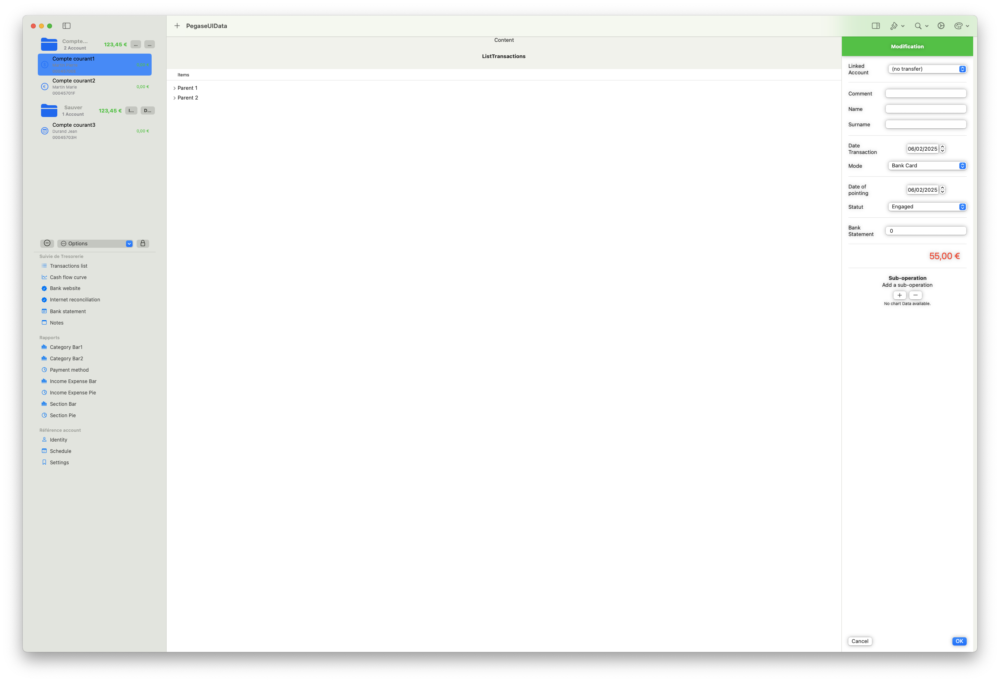

I convert the Pegase program from swift to swiftui

I converted coredata to SwiftData

Identity = ok

Bank = ok

Statement = ok

Dark/LIght toolBar = ok                         10/11/24

Add helper and definition for SwiftData         15/11/24

I have added a database to my application.
I still have a lot adjustments to make.
Improvement of the database                     20/11/24

Improves Detail view                            13/12/24

Add view mode payment                           20/01/25

Add bank statement                              30/01/25

Improve translation                             02/02/25

Improve change account                          02/02/25

Add rubric                                      03/02/25

Improve alot of things                          05/02/25

Add check                                       05/02/25

Add scheduler                                   05/02/25

<em>Général</em>

<em>Général</em>

<em>Init</em>

<em>Init</em>

<em>Init</em>

<em>Général</em>

<em>Général</em>

