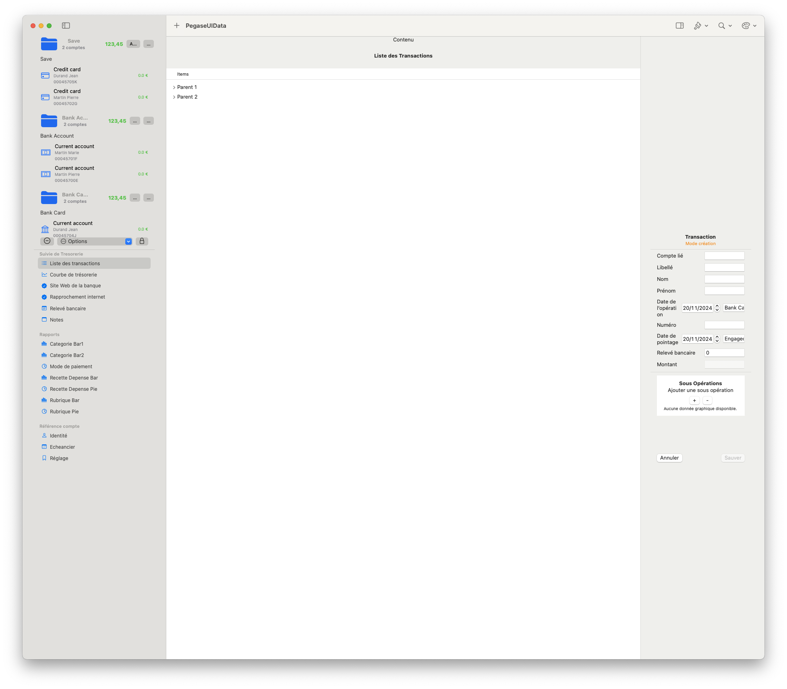
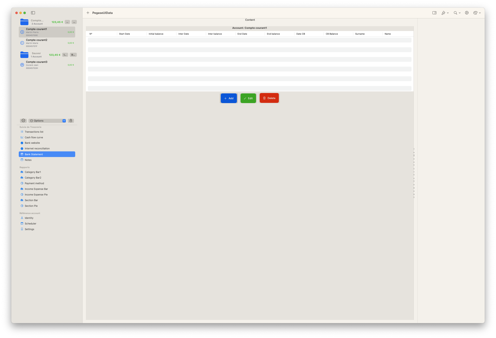
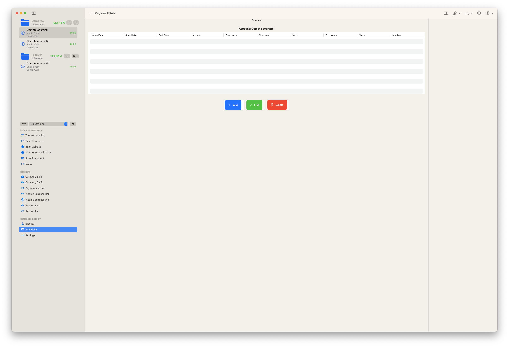
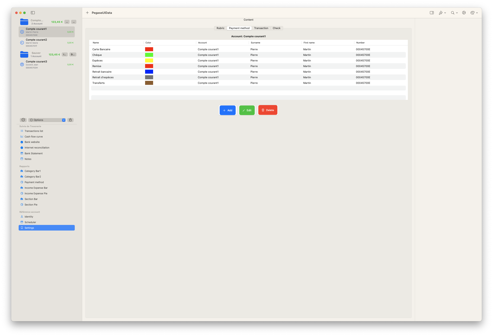
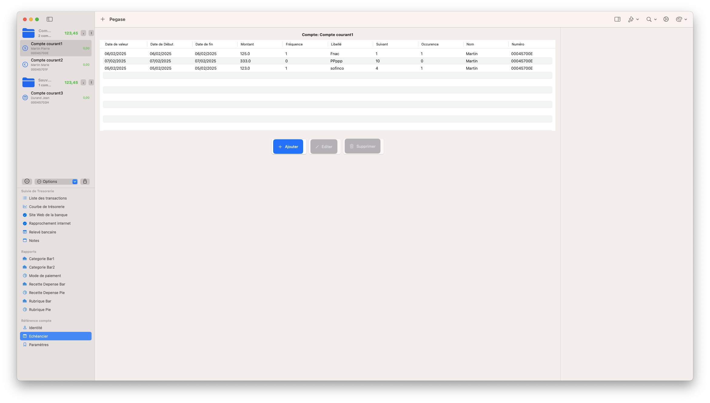
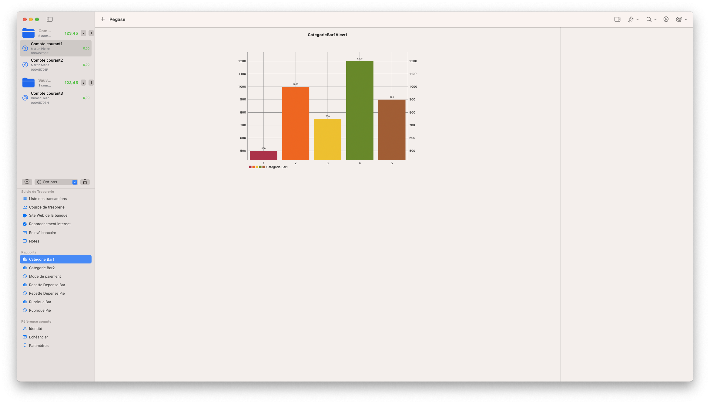

Since the beginning of the Pegase conversion from Swift to SwiftUI, significant progress has been made to modernize the application and enhance its functionality.

    •    Migration to SwiftData: The old CoreData structure has been fully transitioned to SwiftData, with a complete model redesign.
    
    •    Identity ✅
    •    Bank ✅
    •    Bank statement ✅
    •    UI Customization:
    •    Added Dark/Light Mode support for the toolbar (10/11/24).
    •    Improved the Detail View for better readability (13/12/24).
    •    New Features Implemented:
    •    Added Payment Mode management (20/01/25).
    •    Integrated Bank Statements (30/01/25).
    •    Introduced Rubrics for better categorization (03/02/25).
    •    Implemented a Payment Scheduler (05/02/25).
    •    Added Check Management (05/02/25).
    •    Developed the Transaction View (26/02/25).
    •    Improvements and Optimizations:
    •    Enhanced Transaction Preferences for a smoother experience (10/03/25).
    •    Code cleanup and optimization for better performance (14/03/25).
    •    Refined the Account Switching mechanism for improved usability (02/02/25).
    •    Improved Translations to make the application more accessible (02/02/25).
    •    Most Recent Advancement:
    •    Added CSV transaction import (19/03/25), enabling more flexible financial data management.
    •    Display sub transaction (20/03/25)
    

Step by step, Pegase is shaping up and is now starting to function as intended. 🚀

/// Représente un groupe de transactions d'un mois précis (par exemple 2023-02).
struct TransactionsByMonth: Identifiable {
    let id = UUID()
    let year: String
    let month: Int
    let transactions: [EntityTransactions]

    /// Formatage mois (ex: "Février")
    var monthName: String {
        let formatter = DateFormatter()
        formatter.locale = Locale(identifier: "fr_FR") // ou "en_US" etc.
        formatter.dateFormat = "LLLL" // nom du mois
        if let transaction = transactions.first,
           let date = transaction.datePointage {
            return formatter.string(from: date).capitalized
        }
        return "Mois Inconnu"
    }

    /// Calcul du total du mois
    var totalAmount: Double {
        transactions.reduce(0.0) { $0 + $1.amount }
    }
}

/// Représente un regroupement par année.  
struct TransactionsByYear: Identifiable {
    let id = UUID()
    let year: String
    let months: [TransactionsByMonth]
}

<em>List</em>

<em>Bank statement</em>

<em>Scheduler</em>

<em>Payment method</em>

<em>Général</em>

<em>Category Bar</em>

